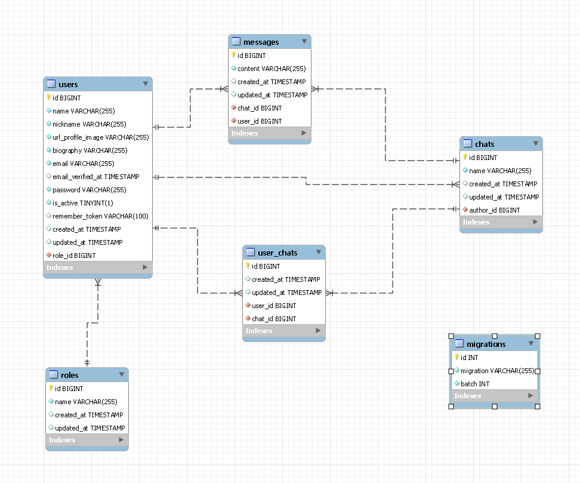

### Laravel Backend LetsApp! 


<p>Hi geeks!,i´ve made an api backend about an instant messaging app </p>


### Index 📚

<details>
  <summary> Content 📝</summary>
  <ol>
    <li><a href="#local-installation">Local installation</a></li>
    <li><a href="#stack">Stack</a></li>
    <li><a href="#database-design">Database Design</a></li>
    <li><a href="#endpoints">Endpoints</a></li>
    <li><a href="#future-features">Future features</a></li>
    <li><a href="#author-">Author</a></li>
    <li><a href="#time-of-development-">Time of development</a></li>
  </ol>
</details>


### Local installation 

1. If you don't have MySQL installed on you computer, you can install Docker and execute the above command on your Powershell to create a MySQL container
` $ docker run --name container-name -p 3307:3306 -e MYSQL_ROOT_PASSWORD=1234 -d mysql `

2. Clone the repository
` $ git clone https://github.com/FRR95/Instant-Messaging-Api.git `

3. Install dependencies
  `$ composer install`

4. Run Migrations and seeders
`$ php artisan migrate:fresh --seed`


You will need to rename the ".env.sample" to ".env". That .env.sample matches the MySQL credentials on the Docker we put as example.


### Stack 

<div align="center">
<a href="https://www.mysql.com/">
    
</a>
<a href="https://www.php.net/">
    
</a>
<a href="https://laravel.com/">
    
</a>
<a href="https://getcomposer.org/">
    
</a>
  <a href="https://git-scm.com/">
    
</a>
  <a href="https://www.postman.com/">
    
</a>
</div>

### Database Design 



### Endpoints 
<details>
<summary>Details</summary>

**In every endpoint you need to put this in your client**

- Headers > Accept > value


``` json
application/json
```


- Auth
    - Register:

            POST http://localhost:8000/api/auth/register
        
        body:


        ``` json
            {
                "name": "Luis",
                "nickname":"@Luis",
                "email": "luis@luis.com",
                "password": "12345678"
            }
        ```


    - Log in

            POST http://localhost:8000/api/login 
        
        body:


        ``` json
            {
                "email": "luis@luis.com",
                "password": "12345678"
            }
        ```
    
    - GET: Get user profile info *
    http://localhost:8000/api/user/me


    - DELETE: logout *
    http://localhost:8000/api/logout

    - POST: change is active user to false *
    http://localhost:8000/api/logout

- Users
    - PUT: update profile *
    http://localhost:8000/api/user/me

    ```sh
    {
        "name":"[your name here]",
        "biography":"[your biography here]"
    }
    ```

    - GET: get all users *
    http://localhost:8000/api/users?page=(number of page)?nickname=(user name or nickname)

    - GET: get user profile * 
    http://localhost:8000/api/users/{id}


    - PUT: update user profile by Id * (admin)
    http://localhost:8000/api/games/{id}

    ```sh
    {
        "name": "[your name here]",
        "biography": "[biography here]"
       
    }
    ```

    - DELETE: Delete more than one user * 
    http://localhost:8000/api/users

       ```sh
    {
        "checkbox": "[array users id]",
       
       
    }
    ```

      - DELETE: Delete  one user * 
       http://localhost:8000/api/user/{id}


- Chats
    - GET: get user chats *
    http://localhost:8000/api/chats


    - POST: create new chat *
    http://localhost:8000/api/chats 


    ```sh
    {
        "name": "[chat name here]",
    }
    ```

    - PUT: update chat *
    http://localhost:8000/api/chats/{id}


    ```sh
    {
        "name": "[chat here]"
    }
    ```

    - DELETE: delete chat *
    http://localhost:8000/api/chats/{id}

- User Chats

    - GET: get all users from chat *
    http://localhost:8000/api/userchats/{id}


    - POST: add user to chat * (author of the chat)
    http://localhost:8000/api/userchats/user/{userId}/chat/{chatId}


    - DELETE: remove user from chat * (author of the chat)
    http://localhost:8000/api/userchats/user/{userId}/chat/{chatId}

    - DELETE: leave chat * 
    http://localhost:8000/api/userchats/user/{chatId}
  

- Messages

   - GET: get all messages from chat *
    http://localhost:8000/api/messages/{chatId}

   - POST: create new message to chat *
    http://localhost:8000/api/messages/{chatId}

       ```sh
    {
        "content": "[your message content here]"
    }
    ```

  - PUT: update your message*
    http://localhost:8000/api/messages/{chatId}/message/{messageId}


    ```sh
    {
        "content": "[your message content here]"
    }
    ```
 
  - DELETE: delete your message *
    http://localhost:8000/api/messages/{chatId}/message/{messageId}


*In these cases you need to put your token in your client

- Auth>Bearer>Bearer Token

    ```sh
    {
        [your token here]
    }
    ```

    admin account

      ```sh
    {
        "email":"Admin@gmail.com",
        "password":"12345678"
    }
    ```

</details>

### Future features 

 ⬜Send direct messages to one User (MD)
 


### Author 🙍‍♂️

- **Francisco Rocher Roure** - FullStack Developer
  - [GitHub](https://github.com/FRR95) - [LinkedIn](https://www.linkedin.com/in/franciscorocher/) - [Portfolio](https://franciscorocherdev.com/)

### Time of development ⌛

- Two Weeks


